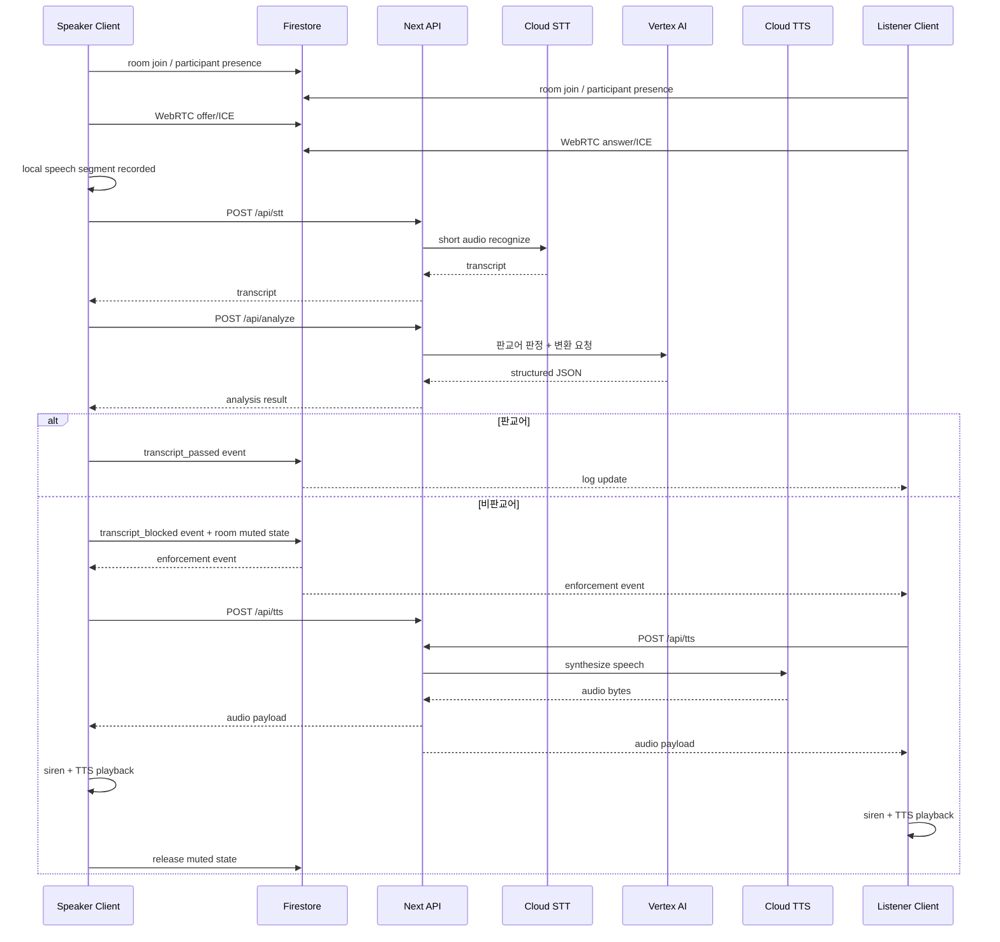

# Align.ai 해커톤 구현 기준 문서

## 1. 문서 목적

이 문서는 `Align.ai`를 5시간 제한 해커톤 안에서 실제 동작 가능한 웹 애플리케이션으로 구현하기 위한 단일 기준 문서다.

- 기존 저장소의 목업 구현은 참고 대상이 아니다.
- 이 문서는 AI 코딩 에이전트와 사람이 함께 구현할 때 참조하는 기준 문서다.
- 요구사항에 없는 기능은 기본적으로 넣지 않는다.
- 불확실한 사실은 단정하지 않고, 구현에 필요한 부분은 `운영 정의` 또는 `제안값`으로 명시한다.

## 2. 프로젝트 한 줄 정의

`Align.ai`는 2인이 화상회의를 하는 동안 발화자의 음성을 판별해 판교어가 아니면 즉시 경고하고, 회의 전체를 잠시 음소거한 뒤 AI가 생성한 판교어 문장을 TTS로 재생하는 웹 앱이다.

## 3. 확정 요구사항

아래 항목은 확정 요구사항으로 취급한다.

- Next.js 기반 웹 애플리케이션이어야 한다.
- 실제 참가자 두 명이 동시에 접속해 화상회의가 가능해야 한다.
- 발화자가 말하는 것을 감지해서 판교어 여부를 판단해야 한다.
- 판교어인 경우 원래 발화를 그대로 통과시켜야 한다.
- 판교어가 아닌 경우 경고를 표시해야 한다.
- 판교어가 아닌 경우 참가자 모두를 앱 내부에서 음소거해야 한다.
- 판교어가 아닌 경우 AI가 생성한 판교어 문장을 TTS로 재생해야 한다.
- GCP Console로 배포해야 하며, 소액 크레딧 안에서 시연 가능한 구성이어야 한다.

## 4. 해커톤 해석 원칙

이 프로젝트는 “가장 완벽한 구조”보다 “5시간 안에 시연 성공 확률이 가장 높은 구조”를 우선한다.

- 화상통화는 `2인 전용`으로 제한한다.
- 브라우저 지원 범위는 `데스크톱 Chrome 최신 버전`을 기준으로 고정한다.
- STT도 GCP 서비스를 사용하되, 해커톤 난이도를 고려해 `짧은 발화 업로드 + 동기 인식` 방식으로 단순화한다.
- 판정과 문장 변환은 GCP 크레딧을 사용하는 AI 호출로 처리한다.
- TTS는 GCP Text-to-Speech를 우선 사용한다.
- 실패 시 바로 보여줄 수 있는 폴백 동작을 반드시 둔다.

## 5. 추천 MVP 범위

이번 해커톤에서 반드시 구현할 범위는 아래와 같다.

- 방 코드 기반 2인 회의방 입장
- 카메라/마이크 권한 획득
- 2인 화상통화 연결
- 현재 회의 상태 표시
- 로컬 발화 구간 감지 및 GCP Speech-to-Text 전송
- 판교어 판정 API 호출
- 판교어 통과 로그 표시
- 비판교어 감지 시 경고 오버레이 표시
- 비판교어 감지 시 강제 음소거 상태 전환
- AI 변환 문장 생성
- TTS 재생
- 강제 음소거 해제

이번 해커톤에서 제외하거나 후순위로 두는 범위는 아래와 같다.

- 3인 이상 회의
- 회의 녹화/저장
- 로그인/회원가입
- 회의 리포트 고도화
- 관리자 대시보드
- TURN 서버 직접 구축
- 모델 파인튜닝

## 6. 추천 기술 선택

| 영역 | 추천 선택 | 이유 |
| --- | --- | --- |
| 웹 프레임워크 | Next.js App Router | 요구사항 충족, 현재 저장소와 일치 |
| 화상통화 | 브라우저 WebRTC P2P | 2인 전용이면 가장 빠르고 저렴함 |
| 시그널링/실시간 상태 | Firestore realtime listener | 서버 없이도 실시간 동기화 가능 |
| STT | Cloud Speech-to-Text V2 | GCP 사용 요구를 충족하면서 짧은 발화 업로드 방식으로 구현 가능 |
| 판교어 판정/변환 | Vertex AI Gemini Flash 계열 | GCP 크레딧 사용, JSON 구조화 응답 가능 |
| TTS | Google Cloud Text-to-Speech | GCP 크레딧 사용, 서버에서 음성 생성 가능 |
| 배포 | GCP의 Cloud Run 서비스 | GCP에 배포하는 방식 중 하나이며, HTTPS 기본 제공과 Next.js 배포가 쉬움 |

## 7. 왜 이 조합이 가장 현실적인가

### 7.1 WebRTC P2P

- 요구사항이 정확히 2인이므로 SFU까지 갈 필요가 없다.
- 별도 미디어 서버를 운영하지 않아도 된다.
- 구현량이 크게 줄어든다.

### 7.2 Firestore 시그널링

- `onSnapshot()` 기반 실시간 반영이 쉬워서 offer/answer/ICE 전달에 적합하다.
- 별도 Socket 서버를 구현하지 않아도 된다.
- 룸 상태, 참가자 수, 강제 음소거 상태까지 한곳에서 관리할 수 있다.

### 7.3 GCP Speech-to-Text

- STT도 GCP를 사용하므로 기술 스택 설명이 일관된다.
- Cloud Speech-to-Text V2의 short audio 인식을 사용하면 발화 단위 전사에 충분하다.
- 공식 문서 기준으로 streaming recognition은 gRPC 전용이므로 이번 해커톤에서는 브라우저 직접 스트리밍 대신 `짧은 발화 녹음 -> 서버 업로드 -> 동기 인식`으로 단순화한다.
- 발화자가 자기 마이크만 전송하므로 “누가 말했는지” 판별이 쉽다.

### 7.4 Vertex AI + Cloud TTS

- “AI가 생성한 판교어”와 “TTS” 요구사항을 정면으로 만족시킨다.
- 데모 수준 호출량은 매우 작아서 소액 크레딧 안에서 충분히 시연 가능하다.

## 8. 운영 정의: 판교어

`판교어`는 공식 표준이 아니므로, 해커톤 구현을 위해 아래와 같이 운영 정의한다.

판교어로 간주하는 특징:

- 스타트업/IT 업무 문맥의 단어가 섞여 있다.
- 한국어 문장 안에 영어 업무 용어가 자연스럽게 끼어 있다.
- 직접적인 거절 대신 우회적이고 정렬 지향적인 표현을 쓴다.
- “정리, 싱크, 얼라인, 우선순위, 액션아이템, 로드맵” 같은 어휘가 자주 등장한다.

판교어 예시:

- “이 아젠다 먼저 얼라인하고 액션아이템 정리해볼게요.”
- “지금 이슈는 재현됐고, 원인 파악해서 오후에 다시 싱크드릴게요.”
- “우선순위 기준으로 스코프를 조금 줄이는 방향이 맞아 보여요.”

판교어가 아닌 예시:

- “이거 못 해요.”
- “몰라요.”
- “왜 이 회의를 해요?”
- “싫어요.”
- “버그예요.”

## 9. 판교어 판정 방식

최종 판정은 서버의 AI 응답을 기준으로 한다. 다만 데모 안정성을 위해 로컬 사전 기반 폴백을 둔다.

### 9.1 1차 전사

- 클라이언트는 자기 마이크 입력만 감지한다.
- 발화 시작 후 `2~5초` 정도의 짧은 구간을 녹음한다.
- 권장 포맷은 `audio/webm;codecs=opus`다.
- 음성 구간이 끝나면 `/api/stt`로 오디오를 업로드한다.

### 9.2 2차 판정

- 서버는 Cloud Speech-to-Text V2로 텍스트를 얻는다.
- 빈 문자열, 한두 글자 잡음, 너무 짧은 감탄사는 무시한다.
- 유효 텍스트면 `/api/analyze` 흐름으로 넘긴다.
- 서버는 Vertex AI에 “판교어 여부 판정 + 점수 + 변환 문장”을 JSON으로 요청한다.

### 9.3 3차 폴백

AI 호출 실패 시 아래 사전 기반 규칙으로 임시 판정한다.

- 판교어 키워드가 하나라도 포함되면 `통과`
- 그렇지 않으면 `차단`
- 차단 시 사전 기반 템플릿으로 임시 판교어 문장을 생성

## 10. 추천 판교어 키워드 사전

아래는 시작점이다. 최종 단어장은 구현 중 확장 가능하다.

```text
얼라인, 싱크, 아젠다, 액션아이템, 로드맵, 마일스톤, 오너십, 컨텍스트,
우선순위, 스코프, 블로커, 언블락, 리소스, 임팩트, 밸류, 레버리지,
핸들링, 드라이브, 팔로우업, 캐치업, KPI, 디펜던시, 딜리버리, 방향성,
밸리데이션, 업데이트, 공유드릴게요, 정리드릴게요, 기준으로, 레벨에서
```

## 11. 판교어 변환 예시

AI 프롬프트와 테스트 케이스에서 아래 예시를 활용한다.

| 원문 | 기대 판정 | 추천 변환문 |
| --- | --- | --- |
| 이거 못 해요 | 차단 | 현재 리소스 기준으로는 바로 진행이 어려워서 우선순위 얼라인 후 다시 공유드릴게요. |
| 몰라요 | 차단 | 지금은 컨텍스트가 부족해서 확인 후 바로 업데이트드릴게요. |
| 이 회의 왜 해요 | 차단 | 이번 미팅의 아젠다와 기대 아웃풋을 먼저 얼라인하면 좋겠습니다. |
| 싫어요 | 차단 | 이 방향은 임팩트 대비 효율이 낮아 보여서 대안까지 같이 검토해보면 좋겠습니다. |
| 버그예요 | 차단 | 현재 이슈가 재현되고 있어서 원인 파악 후 액션아이템 기준으로 정리드릴게요. |
| 오늘 이 안건 먼저 싱크 맞추죠 | 통과 | 원문 그대로 송출 |
| 우선순위 기준으로 스코프 줄이는 게 맞아요 | 통과 | 원문 그대로 송출 |

## 12. 시스템 전체 흐름



## 13. 핵심 동작 규칙

### 13.1 발화 인식 규칙

- 각 클라이언트는 `자기 마이크에서 나온 말`만 STT 처리한다.
- 원격 참가자의 오디오는 STT 대상이 아니다.
- 발화 구간은 `무음 타임아웃` 기준으로 끊는다.
- 권장 초기값은 `1.0 ~ 1.2초 무음` 후 발화 종료다.
- 업로드 길이는 `60초 미만`을 유지한다.

### 13.2 통과 규칙

- AI가 판교어라고 판단하면 원문 로그만 남긴다.
- 별도 TTS는 재생하지 않는다.

### 13.3 차단 규칙

- AI가 비판교어라고 판단하면 즉시 회의 상태를 `forcedMuted`로 바꾼다.
- 모든 참가자는 앱 내부에서 마이크 전송과 원격 오디오 재생을 잠시 막는다.
- 경고 오버레이를 띄운다.
- 변환된 판교어 문장을 TTS로 재생한다.
- TTS가 끝나거나 타임아웃이 지나면 강제 음소거를 해제한다.

### 13.4 음소거 정의

브라우저 앱이 다른 참가자의 운영체제 전체 음량을 제어할 수는 없으므로, 이번 구현에서 `모두 음소거`는 아래를 의미한다.

- 로컬 마이크 트랙 `enabled = false`
- 원격 오디오 엘리먼트 `muted = true`
- 강제 음소거 중에는 수동 언뮤트 버튼 비활성화

즉, 앱 내부 회의 경험 기준으로 전원 음소거 상태를 만든다.

### 13.5 재귀 오탐 방지

TTS가 재생되는 동안 STT는 반드시 일시정지한다.

- 이유 1: 스피커에서 나온 TTS를 다시 STT가 잡는 문제 방지
- 이유 2: 차단 이벤트가 연쇄적으로 재발생하는 문제 방지

## 14. 권장 상태 머신

룸 상태는 아래 4개로 단순화한다.

- `waiting`: 2인이 모두 입장하기 전
- `live`: 정상 회의 중
- `forced-muted`: 비판교어 차단 중
- `ended`: 회의 종료

참가자 오디오 상태는 아래 2개 플래그를 조합한다.

- `manualMuted`: 사용자가 직접 음소거함
- `forcedMuted`: 시스템이 강제로 음소거함

최종 마이크 상태는 아래 규칙으로 계산한다.

```text
effectiveMuted = manualMuted || forcedMuted
```

## 15. 화면 요구사항

### 15.1 로비 페이지

- 닉네임 입력
- 방 코드 입력 또는 생성
- 브라우저 지원 안내
- 카메라/마이크 권한 요청 안내
- 입장 버튼

### 15.2 회의방 페이지

- 내 영상 타일
- 상대 영상 타일
- 현재 회의 상태 배지
- 마이크/카메라 토글
- STT 전송 상태 또는 최근 전사 텍스트 표시
- 회의 이벤트 로그
- 강제 음소거 경고 오버레이
- TTS 재생 중 상태 표시

### 15.3 차단 오버레이 문구 예시

- 제목: `판교어 미탑재 발화 감지`
- 본문: `회의 언어를 정렬하는 중입니다. 잠시만 기다려주세요.`

## 16. 권장 Firestore 데이터 모델

### 16.1 rooms/{roomId}

```json
{
  "createdAt": "serverTimestamp",
  "createdBy": "participantId",
  "status": "waiting",
  "maxParticipants": 2,
  "enforcement": {
    "active": false,
    "triggeredBy": null,
    "eventId": null,
    "releaseAt": null
  }
}
```

### 16.2 rooms/{roomId}/participants/{participantId}

```json
{
  "displayName": "Alex",
  "joinedAt": "serverTimestamp",
  "presence": "online",
  "manualMuted": false,
  "cameraEnabled": true,
  "isHost": false
}
```

### 16.3 rooms/{roomId}/signals/{signalId}

```json
{
  "from": "participant-a",
  "to": "participant-b",
  "type": "offer",
  "payload": {},
  "createdAt": "serverTimestamp"
}
```

`type`은 아래 값만 사용한다.

- `offer`
- `answer`
- `ice`

### 16.4 rooms/{roomId}/events/{eventId}

```json
{
  "type": "transcript_blocked",
  "speakerId": "participant-a",
  "speakerName": "Alex",
  "originalText": "이거 못 해요",
  "replacementText": "현재 리소스 기준으로는 바로 진행이 어려워서 우선순위 얼라인 후 다시 공유드릴게요.",
  "pangyoScore": 22,
  "matchedKeywords": [],
  "reason": "직접 거절 표현이며 판교어 특징이 없음",
  "createdAt": "serverTimestamp"
}
```

`type`은 아래 이벤트만 있으면 충분하다.

- `transcript_passed`
- `transcript_blocked`
- `system_warning`
- `system_recovered`

## 17. 권장 파일 구조

기존 목업 구조와 무관하게 아래처럼 재구성하는 것을 권장한다.

```text
app/
  page.tsx
  room/[roomId]/page.tsx
  api/stt/route.ts
  api/analyze/route.ts
  api/tts/route.ts
  api/health/route.ts
components/
  lobby/
  room/
  shared/
lib/
  firebase/client.ts
  firebase/firestore-room.ts
  webrtc/peer.ts
  speech/recorder.ts
  speech/voice-activity.ts
  speech/audio-playback.ts
  pangyo/dictionary.ts
  pangyo/fallback.ts
  pangyo/prompt.ts
  server/google-auth.ts
types/
  room.ts
  event.ts
  pangyo.ts
```

### 17.1 권장 의존성

- `firebase`
- `google-auth-library`
- 선택 사항: `zod`
- 선택 사항: 간단한 오디오 MIME 유틸

원칙:

- 실시간 룸 상태와 시그널링은 `firebase` 하나로 처리한다.
- Speech-to-Text, Vertex AI, TTS는 서버에서 `google-auth-library` 기반 인증 후 REST 호출한다.
- 이번 해커톤에서는 Socket.IO, TURN 서버 프레임워크, 대형 미디어 서버 라이브러리를 우선 도입하지 않는다.

## 18. API 계약

### 18.1 `POST /api/stt`

요청:

- `multipart/form-data`
- 필드 `audio`: 녹음된 발화 파일
- 필드 `mimeType`: 예) `audio/webm`
- 필드 `roomId`
- 필드 `speakerName`

응답:

```json
{
  "transcript": "이거 못 해요",
  "durationMs": 2400,
  "ignored": false
}
```

규칙:

- Cloud Speech-to-Text V2 short audio 인식을 사용한다.
- 전사 결과가 비어 있거나 너무 짧으면 `ignored=true`를 반환한다.
- 구현 단순화를 위해 발화 하나당 파일 하나를 업로드한다.

### 18.2 `POST /api/analyze`

요청:

```json
{
  "transcript": "이거 못 해요",
  "speakerName": "Alex",
  "roomId": "AB12CD"
}
```

응답:

```json
{
  "isPangyo": false,
  "pangyoScore": 22,
  "reason": "직접 거절 표현이며 판교어 특징이 없음",
  "matchedKeywords": [],
  "replacementText": "현재 리소스 기준으로는 바로 진행이 어려워서 우선순위 얼라인 후 다시 공유드릴게요.",
  "warningText": "판교어 미탑재 발화가 감지되었습니다."
}
```

규칙:

- `isPangyo = true`면 `replacementText`는 빈 문자열이어도 된다.
- `isPangyo = false`면 `replacementText`는 반드시 있어야 한다.
- 응답은 반드시 JSON 하나로 끝나야 한다.

### 18.3 `POST /api/tts`

요청:

```json
{
  "text": "현재 리소스 기준으로는 바로 진행이 어려워서 우선순위 얼라인 후 다시 공유드릴게요."
}
```

응답:

```json
{
  "mimeType": "audio/mp3",
  "audioBase64": "<base64>"
}
```

규칙:

- 실패 시 500과 에러 메시지를 반환한다.
- 클라이언트는 실패 시 브라우저 `speechSynthesis`로 폴백한다.

### 18.4 `GET /api/health`

응답:

```json
{
  "ok": true
}
```

## 19. Vertex AI 프롬프트 기준안

아래는 구현 시 사용할 시스템 프롬프트 초안이다.

```text
너는 한국 스타트업 회의체의 "판교어"를 판정하는 심사기다.
입력 문장이 판교어인지 아닌지를 판단하고, 반드시 JSON만 반환한다.

판교어 특징:
- 한국어 문장에 IT/스타트업 업무 용어가 자연스럽게 섞여 있다.
- 직접적 거절보다 우회적이고 정렬 지향적 표현을 쓴다.
- 예: 얼라인, 싱크, 아젠다, 액션아이템, 우선순위, 스코프, 로드맵, 컨텍스트, 오너십

출력 JSON 스키마:
{
  "isPangyo": boolean,
  "pangyoScore": number,
  "reason": string,
  "matchedKeywords": string[],
  "replacementText": string,
  "warningText": string
}

판정 규칙:
- 판교어면 isPangyo=true
- 판교어가 아니면 isPangyo=false
- 점수는 0부터 100까지
- replacementText는 isPangyo=false일 때만 작성
- replacementText는 자연스러운 한국어 문장으로 작성하되 1~2개의 판교어 표현을 섞는다
- 조롱하거나 과도하게 길지 않게 작성한다
- JSON 외 텍스트는 절대 출력하지 않는다
```

## 20. TTS 기준안

권장 전략:

- 서버에서 Google Cloud Text-to-Speech를 호출한다.
- 한국어 음성으로 재생한다.
- 입력 텍스트는 AI가 생성한 `replacementText`를 그대로 사용한다.

권장 폴백:

- 서버 TTS 실패 시 클라이언트 `speechSynthesis`를 사용한다.

이유:

- GCP TTS는 요구사항 충족용 메인 경로다.
- 브라우저 TTS 폴백이 있으면 데모 실패 확률이 크게 줄어든다.

### 20.1 STT 기준안

권장 전략:

- 클라이언트는 `MediaRecorder`로 발화 구간을 짧게 녹음한다.
- Next.js `POST /api/stt`가 업로드를 받는다.
- 서버는 Cloud Speech-to-Text V2의 synchronous recognize로 전사한다.
- 전사 성공 후에만 판교어 판정 로직으로 넘긴다.

이 방식을 쓰는 이유:

- 공식 문서 기준으로 streaming recognition은 gRPC 전용이므로 브라우저에서 직접 붙이기보다 구현이 단순하다.
- short audio recognition은 60초 미만 음성에 적합하다.
- 해커톤 요구사항인 “발화 감지 후 판정”을 충분히 만족한다.

## 21. WebRTC 구현 기준

### 21.1 연결 방식

- 2인 전용 P2P
- STUN 서버는 기본 공개 STUN을 사용
- TURN 서버는 이번 해커톤 범위에서 제외

권장 ICE 서버 예시:

```ts
{
  iceServers: [{ urls: "stun:stun.l.google.com:19302" }]
}
```

### 21.2 미디어 제약

```ts
{
  audio: {
    echoCancellation: true,
    noiseSuppression: true,
    autoGainControl: true
  },
  video: true
}
```

### 21.3 룸 인원 제한

- 참가자 2명 초과 시 입장 차단
- 메시지: `이 방은 2인 전용입니다.`

## 22. 브라우저/디바이스 제약

이번 MVP는 아래 환경만 지원 대상으로 삼는다.

- 데스크톱 Chrome 최신 버전
- HTTPS 접속 환경
- 카메라/마이크 권한 허용

지원 대상에서 사실상 제외:

- Safari
- Firefox
- 모바일 브라우저

이유:

- MediaRecorder, WebRTC, 자동재생 제약을 함께 안정적으로 통제하기 쉽다.
- 해커톤 데모 성공 확률을 위해 지원 범위를 좁힌다.

## 23. GCP 구성안

여기서 `GCP에 배포한다`는 말은 추상적인 한 문장이 아니라, 실제로는 `GCP 안의 어떤 서비스에 올릴지`를 정한다는 뜻이다.

- GCP는 전체 플랫폼 이름이다.
- Cloud Run은 GCP 안에 있는 배포 서비스 중 하나다.
- 즉 `GCP에 배포`와 `Cloud Run에 배포`는 서로 반대말이 아니라, `GCP에 있는 Cloud Run 서비스를 사용해 배포`한다는 관계다.

이번 문서에서 Cloud Run을 추천한 이유는 아래와 같다.

- Next.js 앱을 한 서비스로 배포하기 쉽다.
- HTTPS 엔드포인트를 바로 받는다.
- 서버를 직접 관리하지 않아도 된다.
- 해커톤에서 배포 속도가 빠르다.

### 23.1 필수 서비스

- Cloud Run
- Cloud Build
- Artifact Registry
- Firestore
- Speech-to-Text
- Vertex AI
- Cloud Text-to-Speech

### 23.2 권장 배포 구조

- Next.js 앱 전체를 Cloud Run에 배포
- Firestore는 룸 상태/시그널링 저장소
- Speech-to-Text, Vertex AI, TTS는 Next API Route에서 서버 호출
- 사용자 로그인 UI는 두지 않는다
- Firestore 접근 제어는 해커톤용 최소 규칙으로 시작한다

해커톤 인증 전략:

- 기본값은 `무로그인 입장`이다.
- 이 문서 기준 MVP는 방 코드와 2인 제한으로 접근 범위를 좁힌다.
- 이는 데모용 전략이며 운영 서비스 수준의 보안 설계는 아니다.
- 시간이 남으면 Firebase Anonymous Auth를 후속 보강으로 붙인다.

### 23.3 권장 리전

- Cloud Run과 Firestore는 `asia-northeast3`(서울) 우선 검토
- Vertex AI는 배포 시점에 `Gemini Flash` 사용 가능 리전을 콘솔에서 확인 후 설정

주의:

- Vertex AI 모델 ID와 사용 가능 리전은 배포 시점 기준으로 콘솔에서 최종 확인한다.
- 문서에는 특정 모델 ID를 고정하지 않는다.

## 24. 환경 변수 초안

```bash
NEXT_PUBLIC_FIREBASE_API_KEY=
NEXT_PUBLIC_FIREBASE_AUTH_DOMAIN=
NEXT_PUBLIC_FIREBASE_PROJECT_ID=
NEXT_PUBLIC_FIREBASE_STORAGE_BUCKET=
NEXT_PUBLIC_FIREBASE_MESSAGING_SENDER_ID=
NEXT_PUBLIC_FIREBASE_APP_ID=

GOOGLE_CLOUD_PROJECT_ID=
STT_LOCATION=global
STT_LANGUAGE_CODES=ko-KR
STT_MODEL=short
VERTEX_AI_LOCATION=
VERTEX_AI_MODEL=
TTS_LANGUAGE_CODE=ko-KR
TTS_VOICE_NAME=
```

원칙:

- 서비스 계정 JSON 파일을 저장소에 넣지 않는다.
- Cloud Run 런타임 서비스 계정 권한으로 API를 호출한다.

## 25. 구현 우선순위

아래 순서대로 만들면 해커톤 리스크가 가장 낮다.

1. 로비/회의방 골격 UI
2. Firestore 룸 입장 및 2인 제한
3. WebRTC 2인 영상 연결
4. 발화 구간 녹음과 `/api/stt`
5. `/api/analyze`
6. 차단 이벤트와 강제 음소거
7. `/api/tts`
8. 배포
9. 데모 리허설

## 26. 5시간 작업 계획

### 0:00 ~ 0:40

- Firebase 설정
- 기본 라우트/레이아웃 정리
- 로비와 회의방 UI 뼈대 생성

### 0:40 ~ 1:50

- Firestore 룸 생성/입장
- 참가자 2인 제한
- WebRTC offer/answer/ICE 연결
- 카메라/마이크 토글

### 1:50 ~ 2:40

- 발화 구간 감지
- `MediaRecorder` 업로드
- `/api/stt`와 전사 결과 로그 출력

### 2:40 ~ 3:30

- `/api/analyze` 작성
- Vertex AI 판정 및 변환
- 실패 시 사전 기반 폴백 처리

### 3:30 ~ 4:10

- 강제 음소거 상태 동기화
- 경고 오버레이
- TTS 재생 및 복구 로직

### 4:10 ~ 4:40

- Cloud Run 배포
- 환경 변수 세팅
- 실기기 2대 테스트

### 4:40 ~ 5:00

- 시연 시나리오 리허설
- 치명 버그 수정
- 문구 다듬기

## 27. 시연 시나리오

1. 사용자 A와 B가 같은 방 코드로 입장한다.
2. 서로 영상/음성이 정상 연결된다.
3. 사용자 A가 판교어를 말한다.
4. 시스템이 통과 처리하고 로그에 남긴다.
5. 사용자 A가 “이거 못 해요” 같은 일반 발화를 말한다.
6. 경고 오버레이가 뜬다.
7. 두 사용자 모두 앱 내부에서 강제 음소거된다.
8. 변환된 판교어 문장이 TTS로 재생된다.
9. 잠시 후 강제 음소거가 해제되고 회의가 재개된다.

## 28. 테스트 체크리스트

- 두 브라우저에서 같은 방에 정상 입장되는가
- 3번째 사용자는 입장 차단되는가
- 카메라/마이크 권한이 정상 요청되는가
- 두 참가자의 영상과 음성이 서로 들리는가
- `/api/stt`가 한국어 발화를 전사하는가
- 판교어 발화는 차단되지 않는가
- 비판교어 발화는 차단되는가
- 차단 시 오버레이가 양쪽에 동시에 뜨는가
- 차단 시 양쪽 마이크/오디오가 앱 내부에서 막히는가
- TTS가 양쪽에서 재생되는가
- TTS 종료 후 회의가 복구되는가
- TTS 실패 시 브라우저 TTS 폴백이 동작하는가

## 29. 주요 리스크와 대응

### 29.1 발화 구간 분리 실패

리스크:

- 한 문장이 너무 짧게 잘리거나 너무 길게 녹음될 수 있다.

대응:

- 무음 종료 시간을 `1.0 ~ 1.2초`에서 조정한다.
- 1차 구현은 단순 기준으로 시작하고, 리허설 중 값만 튜닝한다.

### 29.2 Speech-to-Text 업로드 지연

리스크:

- 업로드와 서버 전사 때문에 브라우저 내장 STT보다 반응이 늦을 수 있다.

대응:

- 발화 길이를 짧게 유지한다.
- short audio recognition만 사용한다.

### 29.3 WebRTC NAT 문제

리스크:

- TURN 없이 일부 네트워크에서 연결 실패 가능성이 있다.

대응:

- 데모 전 실제 네트워크에서 리허설한다.
- 가능하면 안정적인 네트워크 환경에서 시연한다.

### 29.4 TTS가 STT에 재유입

리스크:

- TTS 재생 음성이 다시 STT로 들어가 무한 차단을 유발할 수 있다.

대응:

- TTS 재생 중 STT를 정지한다.

### 29.5 오디오 자동재생 제한

리스크:

- 브라우저가 사용자 제스처 없는 오디오 재생을 막을 수 있다.

대응:

- 입장 버튼 클릭 시 오디오 컨텍스트를 미리 활성화한다.

### 29.6 AI 응답 지연

리스크:

- 판정 응답이 느리면 회의 경험이 끊긴다.

대응:

- 짧은 입력만 보낸다.
- JSON 응답만 요구한다.
- 실패 시 즉시 사전 기반 폴백을 사용한다.

## 30. 뒤처질 때 버릴 것

시간이 부족하면 아래 순서대로 과감히 버린다.

1. 시각 효과 고도화
2. 회의 리포트 페이지
3. 상세 회의 로그 필터링
4. 고급 상태 배지
5. 커스텀 사운드 디자인

절대 버리면 안 되는 것:

- 2인 화상 연결
- GCP STT
- 판정
- 강제 음소거
- 변환 문장
- TTS

## 31. 추가 확인이 필요한 항목

아래는 구현은 가능하지만, 기획적으로 나중에 확정하면 더 좋은 항목이다.

- 최종 판교어 사전 단어 10~20개
- 차단 시 경고 사운드 톤
- 차단 지속 시간 상한값
- 회의 종료 후 요약 리포트 필요 여부

이 항목들은 현재 문서의 제안값으로도 구현 가능하다.

## 32. 공식 참고 자료

- Cloud Run 개요: <https://cloud.google.com/run/docs>
- Cloud Run 가격: <https://cloud.google.com/run/pricing>
- Firestore 실시간 리스너: <https://firebase.google.com/docs/firestore/query-data/listen>
- Firestore 무료 할당량: <https://cloud.google.com/firestore/quotas>
- Cloud Speech-to-Text 개요: <https://docs.cloud.google.com/speech-to-text/v2/docs/basics>
- Cloud Speech-to-Text short audio: <https://cloud.google.com/speech-to-text/v2/docs/sync-recognize>
- Cloud Speech-to-Text streaming recognize: <https://docs.cloud.google.com/speech-to-text/v2/docs/streaming-recognize>
- Cloud Speech-to-Text 가격: <https://cloud.google.com/speech-to-text/pricing/>
- Vertex AI `generateContent`: <https://docs.cloud.google.com/vertex-ai/generative-ai/docs/model-reference/inference>
- Vertex AI REST `generateContent`: <https://cloud.google.com/vertex-ai/docs/reference/rest/v1/projects.locations.endpoints/generateContent>
- Cloud Text-to-Speech REST: <https://docs.cloud.google.com/text-to-speech/docs/reference/rest/v1/text/synthesize>

## 33. 최종 결론

이번 해커톤에서 가장 현실적인 구현 경로는 아래 한 줄로 요약된다.

`Next.js + WebRTC P2P + Firestore 시그널링 + Cloud Speech-to-Text + Vertex AI 판정/변환 + Cloud TTS + Cloud Run 배포`

이 조합은 요구사항을 정면으로 만족하면서도, 5시간 안에 실제 시연 가능한 확률이 가장 높다.
